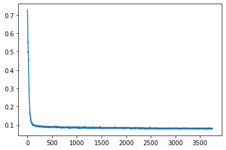
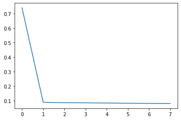
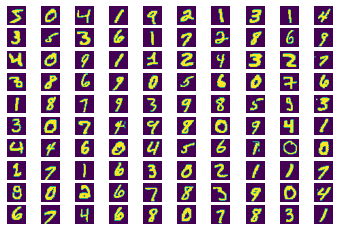
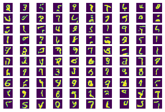

# basic_pixel_cnn_pytorch

## Source Paper

This code is the implementation of pixelCNN. Idea was proposed in the paper - 

**Pixel Recurrent Neural Networks** 

[Link to Paper](https://arxiv.org/abs/1601.06759)

--- 

## Training Data

MNIST Dataset is used for training. Pixel values are converted to binary values before training. 

The network is trained only on the single channel images. But the implementation for 3 channel images, where each channel is independent is also done. 

 
--- 

## Network Details

* Masked Convolution Layer 
  * Fixed Mask applied on the 2D convolution layer. There are 2 types of masks 
    * mask_type A -> channel R dependent on (context), G dependent on (context,R) , B dependent on (context,R,G )-> used in first layer
    * mask_type B -> channel R dependent on (context,R), G dependent on (context,R,G) , B dependent on (context,R,G,B)-> used in layers except first

* Residual Block 
  * Proposed in the network structure in original paper
  
* Loss 
  * Cross entropy loss

### TODO 
* Gated Convolution Layer to improve context and remove blind spot
* Consider mixture of logistics at the final prediction layer (Pixel CNN ++)
* Conditional generation on pixelCNN

----
## Training Loss 

Training loss is plotted after each iteration on batch of 128 images. 

----

## Validation Loss 

Validation loss is calculated on the valid data after each epoch.

---

## MNIST Images (Original)

---

## MNIST Images (Generated)

---

